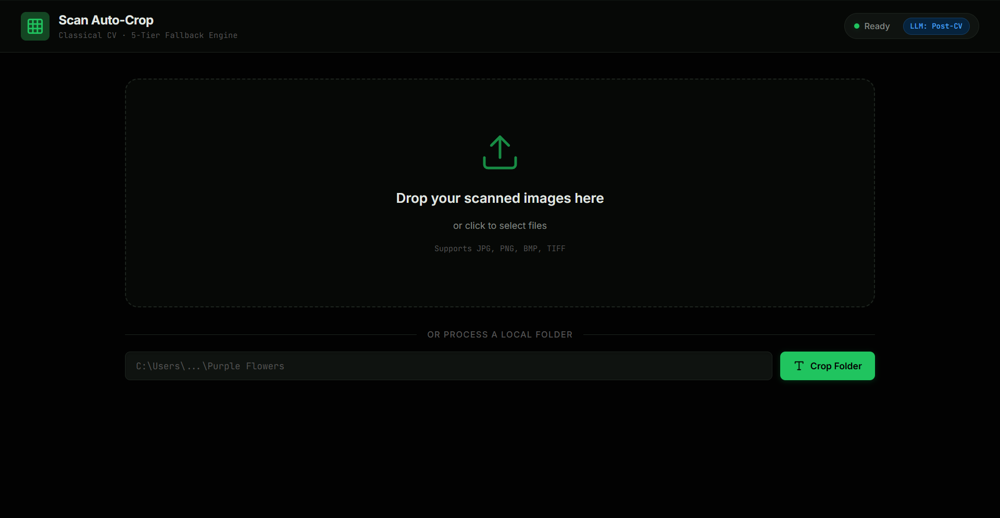

# Intelligent Scan Auto-Crop Pipeline

A practical, production-focused project to automatically crop scanned images using **classical computer vision**.

This project focuses on **reliability, determinism, and scalability**, inspired by professional archival tools.

---

## Table of Contents

- [Project Goal](#project-goal)
- [Quick Start (Web UI)](#quick-start-web-ui)
- [Quick Start (Command Line)](#quick-start-command-line)
- [How the Crop Engine Works](#how-the-crop-engine-works)
- [Project Structure](#project-structure)
- [Safety and Reliability](#safety-and-reliability)
- [Why Not FFmpeg](#why-not-ffmpeg)
- [AI Upscaling (Optional)](#ai-upscaling-optional)
- [Credits](#credits)
- [License](#license)

---

## Project Goal

To build a robust batch image cropping system that:

- Works on scanned photos and documents
- Handles uneven lighting and borders
- Avoids cutting faces or important content
- Works without GPU or heavy AI models
- Can be safely used in automation pipelines

This is a **deterministic system** relying on proven computer vision techniques.
No AI guessing, no vision LLMs, no black-box magic, no heavy GPU usage.

---

## Web UI Preview

The app runs locally in your browser. Dark theme with a drag-and-drop interface for uploading scanned images or pointing at a local folder.



---

## Quick Start (Web UI)

This is the easiest way to use the tool. It gives you a drag-and-drop interface in your browser.

### Prerequisites

You need **Python 3.10 or newer** installed on your system. You can check by running:

```
python --version
```

If you do not have Python, download it from [python.org](https://www.python.org/downloads/).

### Step 1: Install Dependencies

Open a terminal (Command Prompt, PowerShell, or any terminal) and navigate to the `app` folder inside this project:

```
cd "path/to/this/project/app"
```

Then install the required Python packages:

```
pip install -r requirements.txt
```

This only needs to be done once.

### Step 2: Start the Server

From the same `app` folder, run:

```
python run.py
```

You should see output like this:

```
[Scan Auto-Crop] Starting server at http://127.0.0.1:8000
[Scan Auto-Crop] Opening browser...
```

Your default browser will open automatically to the app.

### Step 3: Use the App

You have two options inside the web app:

**Option A: Drag and Drop**

1. Drag your scanned image files from a folder and drop them onto the upload area in the browser.
2. The app uploads and processes them using the 5-tier crop engine.
3. You will see a before/after comparison for every image.
4. Click "Download" on any individual image to save the cropped version.

**Option B: Paste a Folder Path**

1. At the bottom of the page, there is a text field labeled "Crop Folder".
2. Paste the full path to your folder of scanned images. For example:
   ```
   C:\Users\YourName\Desktop\My Scans\Purple Flowers
   ```
3. Click the "Crop Folder" button.
4. The app processes every image in that folder and saves the cropped versions into a new folder next to the original, named `{original folder} - Cropped`.
5. You will see statistics showing how many images were cropped successfully and which strategy was used for each.

### Step 4: Stop the Server

When you are done, go back to the terminal where the server is running and press `Ctrl + C` to stop it.

---

## Quick Start (Command Line)

If you prefer using the terminal without a browser, you can run the crop engine directly from the command line.

### Step 1: Install Dependencies

Same as above. Navigate to `app/` and run:

```
pip install -r requirements.txt
```

### Step 2: Run the Cropper

From the project root (not the `app` folder), run:

```
python app/core/cropper.py "path/to/your/scanned/images"
```

For example:

```
python app/core/cropper.py "scan project SRM/part2/Purple Flowers"
```

This will:

1. Read every image file (JPG, PNG, BMP, TIFF) in that folder.
2. Crop each one using the 5-tier fallback engine.
3. Save all cropped images into a new folder called `{folder name} - Cropped` right next to the original.
4. Print a summary of results showing which strategy was used for each image.

### Specifying a Custom Output Folder

If you want the cropped images saved to a specific location, add a second argument:

```
python app/core/cropper.py "path/to/input/folder" "path/to/output/folder"
```

### Example Output

```
Processing: scan project SRM\part2\Purple Flowers

==================================================
BATCH RESULTS: 265 images
  pro_contour    : 221 (83.4%)
  canny_edge     :  10 ( 3.8%)
  pro_rect       :   5 ( 1.9%)
  original       :  29 (10.9%)
==================================================
```

---

## How the Crop Engine Works

The core insight is simple:

> **Do not detect the photo. Detect the background.**

Instead of trying to find the photo content (which varies wildly between images), we detect the flat, uniform scanner background and crop it away. This is the standard principle used in professional document digitization.

### The 5-Tier Fallback Strategy

The engine tries five different strategies in order. If one fails, it falls back to the next. If all five fail, the original image is kept untouched (zero data loss).

| Tier | Strategy | How It Works | When It Helps |
|------|----------|--------------|---------------|
| 1 | **Otsu + RETR_EXTERNAL** | Binarizes the image using Otsu's automatic threshold, cleans up with morphological closing, then finds the outermost contour only. | Works for most scanned photos with clear borders. This is the primary strategy. |
| 2 | **Canny Edge Detection** | Detects physical edges regardless of fill color using gradient-based edge detection. | Catches "snow photos" where the photo content is white-on-white. |
| 3 | **Variance-based** | Calculates local pixel variance. Scanner background has near-zero variance, while real photos have texture. | Handles stubborn cases where both Otsu and Canny fail. |
| 4 | **Saturation-based** | Scanner backgrounds are pure neutral gray (zero color saturation). Real photos, even snow scenes, have slight color casts. | Works when the image is almost entirely white but has subtle color. |
| 5 | **Gradient Line Scan** | Scans from each edge inward looking for the first row or column with significant gradient changes. | Last resort for finding a physical photo border. |

### Preprocessing Steps

Before the strategies run, every image goes through:

1. **Grayscale conversion** - Simplifies the pixel data.
2. **Gaussian blur** - Reduces scanner noise that could create false edges.
3. **Edge clearing** - Zeros out the outermost 10 pixels of the mask to break scanner noise that "tethers" the photo to the edge.

---

## Project Structure

```
project root/
|
|-- app/                          (the web app - everything you need)
|   |-- core/
|   |   |-- __init__.py
|   |   |-- cropper.py            (the crop engine, also works as CLI)
|   |
|   |-- frontend/
|   |   |-- index.html            (web UI)
|   |   |-- style.css             (green + black theme)
|   |   |-- app.js                (drag and drop logic)
|   |
|   |-- server.py                 (FastAPI backend)
|   |-- run.py                    (starts server + opens browser)
|   |-- requirements.txt          (Python dependencies)
|
|-- batch_crop_pro.py             (original standalone crop script)
|-- batch_crop_opencv.py          (legacy - multi-strategy approach)
|-- batch_crop_safe.py            (legacy - conservative border trim)
|-- batch_crop_final.py           (legacy - PIL-based approach)
|-- batch_crop_aggressive.py      (legacy - aggressive mean threshold)
|-- batch_processor.py            (legacy - ImageChops fuzz method)
|-- batch_processor_fixed.py      (legacy - ImageMagick wrapper)
|-- analyze_crops.py              (compare original vs cropped sizes)
|-- list_uncropped.py             (find images that were not cropped)
|-- enhance_images.py             (AI upscaling helper)
|-- upscale_scans.py              (AI upscaling with Upscayl)
|-- setup_upscayl.py              (extract Upscayl binary from zip)
|
|-- tools/                        (external binaries, gitignored)
|-- README.md
|-- .gitignore
```

**Note:** The `app/` folder is the main working directory for the web app. The Python scripts at the root level are the original standalone batch processors from earlier development. They still work, but `app/core/cropper.py` is the refined version of the same engine.

---

## Safety and Reliability

This pipeline uses multi-level fallback logic:

1. **Primary**: Try external contour crop (exact shape).
2. **Fallback**: If the contour is irregular, switch to bounding-box crop (rectangular safety).
3. **Fail-safe**: If still uncertain, keep the original image unchanged.

This guarantees **zero accidental data loss**. An image is never destroyed or over-cropped. The worst case is that it stays untouched and you crop it manually.

---

## Why Not FFmpeg

Contributors might ask: "Why build a custom Python script instead of using FFmpeg's `cropdetect` filter?"

We analyzed FFmpeg, and while it is excellent for video, it is unsafe for scanned photo archives:

1. **Simple thresholding failure**: FFmpeg relies on simple color difference. It fails on snow photos (white content on white background) or tethered edges (scanner noise), leading to aggressive over-cropping.
2. **No edge clearing**: FFmpeg cannot distinguish between the actual photo edge and scanner dust or artifacts.
3. **Risk of data loss**: Our custom pipeline uses a multi-tier fallback and refuses to crop if uncertain. FFmpeg would simply chop the image, potentially destroying original data.

**Verdict**: Our custom OpenCV pipeline achieves approximately 89% automated accuracy with 100% safety (zero data loss), whereas FFmpeg poses a high risk of data destruction for this specific dataset.

---

## AI Upscaling (Optional)

We included a helper script `upscale_scans.py` for those who want to enhance the original uncropped scans using AI upscaling via [Upscayl](https://github.com/upscayl/upscayl).

### Prerequisites

The upscaling tools are not included in this repo (too large). You must download the `upscayl-bin` executable and models separately.

1. Download Upscayl binary and models.
2. Place them in `tools/ext/` so the structure looks like:

```
tools/ext/
|-- upscayl-bin.exe
|-- models/
    |-- upscayl-lite-4x/
    |-- upscayl-standard-4x/
    |-- ...
```

### Configuration and Hardware Notes

The script is currently configured for low VRAM systems (such as integrated graphics):

- **Model**: Defaults to `upscayl-lite-4x` (fast, low memory).
- **Tiling**: Uses `-t 200` to prevent memory crashes on large scans.

To improve quality (if you have a dedicated GPU):

1. Open `upscale_scans.py`.
2. Change `source_model_name` to `"upscayl-standard-4x"` or `"ultrasharp-4x"`.
3. Reduce tiling (for example, `-t 32` or remove `-t`) if you have more than 4GB of VRAM.

---

## Credits

This project relies on standard open-source libraries:

- **[OpenCV](https://opencv.org/)**: All image processing and computer vision tasks.
- **[NumPy](https://numpy.org/)**: High-performance matrix and array operations.
- **[Pillow](https://pillow.readthedocs.io/)**: Image file I/O and thumbnail generation.
- **[FastAPI](https://fastapi.tiangolo.com/)**: Web API framework for the server.
- **[Uvicorn](https://www.uvicorn.org/)**: ASGI server to run FastAPI.

Logic and methods used (Otsu's Thresholding, Canny Edge Detection, Morphological Operations) are standard algorithms in the field of computer vision.

---

## License

MIT -- free to use, modify, and improve.
